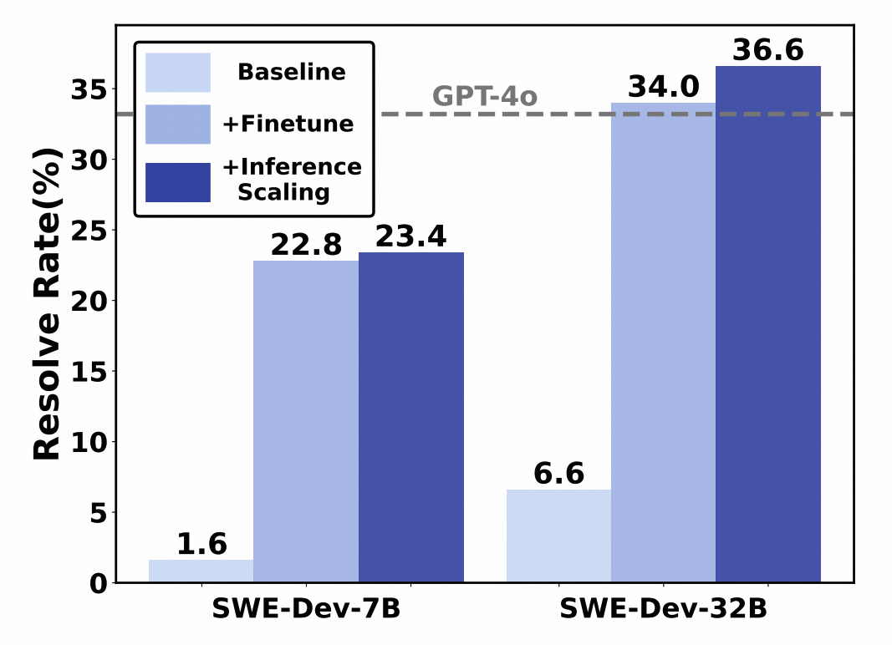
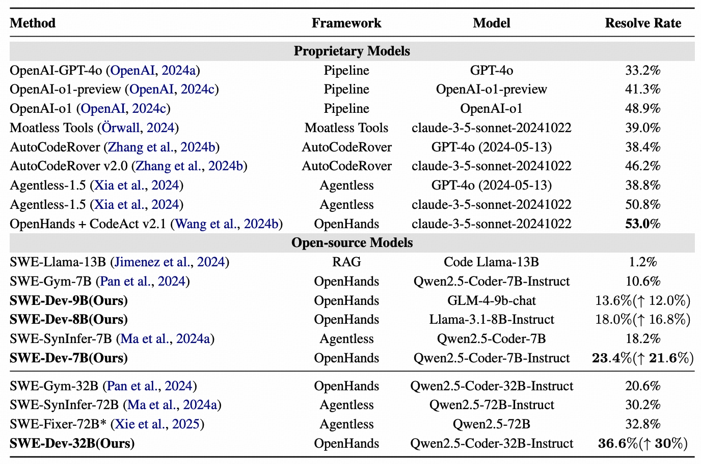
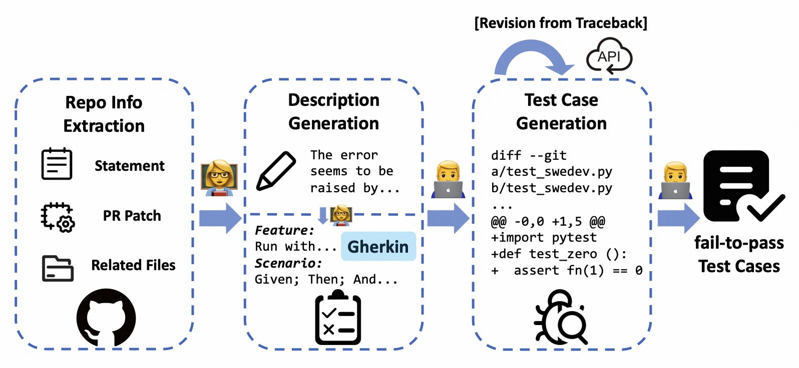

# 🚀 SWE-Dev

> SWE-Dev: Building Software Engineering Agents with Training and Inference Scaling [ACL'25 Findings]
> 
> Haoran Wang*, Zhenyu Hou*, Yao Wei, Jie Tang, Yuxiao Dong

📝 [Paper](https://arxiv.org/abs/2506.07636) | 🤗 [HF(Model)](https://huggingface.co/THUDM/SWE-Dev-32B) | 🤗 [HF(Data)](https://huggingface.co/datasets/THUDM/SWE-Dev-train)

## 💡 Introduction

LLMs have advanced from *conversational problem solving* to *real-world tasks* such as software engineering (SWE). However, building effective SWE agents remains challenging due to the lack of high-quality training data and reliable test-time evaluation. 

To address this issue, we present **SWE-Dev**, an SWE agent built upon open-source LLMs, with a focus on training and inference scaling.

- **For training scaling**, we develop a robust pipeline to synthesize test cases and scale up agent trajectories to construct the training data.
- **For inference scaling**, we increase the interaction budget within a single run to enable further thinking within one independent attempt.

Experiments on the SWE-bench-Verified benchmark show that the SWE-Dev models can achieve top performance among all open SWE agents. 
Specifically, the resolve rate of our 7B and 32B models reach 23.4\% and 36.6\%, respectively, outperforming state-of-the-art open-source models.

<div align="center"></div>

<div align="left"><sup> <strong>Model performance with training and inference scaling.</strong> SWE-Dev demonstrated a 21.8% and 30% performance improvement on the 7B and 32B models, respectively, through scaling in both training and inference. Notably, SWE-Dev-32B achieved a performance of 34.0%, comparable to GPT-4o, even without the benefits of inference scaling. </sup><br><br></div>

<div align="center"></div>

<div align="left"><sup> <strong>Comparison of resolve rates on the SWE-bench-Verified dataset.</strong> The table categorizes models into baselines and SWE agents, showcasing their performance. SWE-Dev models attain top-tier results within the realm of open-source models and concurrently exhibit robust performance among closed-source models. The relative improvement ($\uparrow$) for our models is calculated with respect to their respective base models. </sup><br><br></div>

## 🔄 Pipeline Overview

<div align="center"></div>

<div align="left"><sup> <strong>Pipeline for test case generation</strong>: The pipeline is divided into description generation and code generation phases. It begins with extracting repository information, followed by generating Gherkin scenarios and then detailed test cases. An optional revision step leverages traceback errors to refine the generated test cases. The final output includes fail-to-pass test cases. </sup></div>

### Step 0: 🛠️ Configuration Setup

#### Configuration File

The main configuration file is located at `conf/config/default.yaml` and contains settings for all pipeline stages:

#### Validating Configuration

To validate your configuration:

```bash
python -m swedev.config --validate
```

#### Viewing Configuration

To view the current configuration:

```bash
python -m swedev.config --print
```

#### Overriding Configuration in Command Line

You can override any configuration value when running scripts:

```bash
python your_script.py paths.local_repo_dir=/new/path github.tokens=[token1,token2]
```

#### Using Configuration in Code

```python
from swedev.config import Config

# Access basic configuration
conda_base = Config.conda_base
github_tokens = Config.github_tokens

# Access stage-specific settings
localizer_model = Config.Localizer.model
description_model = Config.Description.model
testcase_model = Config.Testcase.model
revise_rounds = Config.Testcase.revise_rounds
```

#### Environment Variables Fallbacks

### Step 1: 📊 Data Collection from GitHub

Set up your configuration in `conf/config/default.yaml` with GitHub tokens and repository directories before running these commands.

#### Option 1: Collect Top PyPI Repositories

> You need to install chrome driver first. In ubuntu, you can install simply by `apt install chromium-chromedriver`

```bash
python -m swedev.crawl.get_top_pypi \
    --max_repos 100 \
    --output_folder results/packages \
    --num_workers 8 \
    --start_at 0
```

#### Option 2: Fetch All PyPI Repositories

```bash
python -m swedev.crawl.pypi_crawler \
    --output results/packages/github_urls.jsonl \
    --workers 16
```

> ⚠️ Note: Keep concurrency lower to respect GitHub rate limits

#### Process the repositories
```bash
python -m swedev.issues.get_tasks_pipeline \
    --repo_file results/packages/pypi_rankings.jsonl \
    --output_folder results/issues \
    --cutoff_date 20210101 \
    --num_workers 64 \
    --max_pulls 1000
```

If you enable `--do_clone`, the script will clone repositories to the directory specified by `local_repo_dir` in your configuration.

> If you encounter persistent `404 - Error` messages, manually terminate and combine results

```bash
python -m swedev.issues.get_tasks_pipeline \
    --repo_file results/issues/packages/pypi_rankings.jsonl \
    --output_folder results/issues \
    --combine_results
```

### Step 2: 📝 Generate Test Cases

For parallel environments, create a base environment first to avoid Conda concurrent installation issues:
```bash
conda create -n swedevbase python=3.11 -y
conda create -n {env_name} --clone swedevbase # For later usage
```

Before the generation pipeline, you should config your api info at `conf/config.yaml`

First, generate descriptions:
```bash
python -m swedev.testcases.get_descriptions \
    --dataset_file results/issues/all_tasks.jsonl \
    --output_folder results/descriptions \
    --num_workers 16
```

Then generate test cases:
```bash
python -m swedev.testcases.get_testcases \
    --dataset_file results/descriptions/output_f2p.jsonl \
    --top_n 5 \
    --output_folder results/testcases/ \
    --num_workers 80
```

### Step 3: 🧪 Evaluate Test Cases

#### Docker Method

We provide a Dockerfile based on Ubuntu 22.04 that installs all necessary dependencies for evaluation. The image includes comprehensive development tools. If you encounter errors, you can manually install the dependencies in `Dockerfile` and then use `docker commit` to save your image.

First, build the Docker image:
```bash
# Build the Docker image from the provided Dockerfile
docker build -t swedev-evaluator:latest .
```

Run the evaluation container:
```bash
docker run -d --network host \
  -v /raid:/raid \
  -w /raid/SWE-Dev \
  --restart always \
  swedev-evaluator:latest \
  /raid/SWE-Dev/miniforge3/envs/swedev/bin/python -m swedev.testcases.eval_testcases \
  --dataset /raid/SWE-Dev/results/testcases/output.jsonl \
  --output_folder /raid/SWE-Dev/results/evaluation-0508 \
  --num_workers 80
```

You should use **absolute path** when mounting directories

#### Non-Docker Method

```bash
python -m swedev.testcases.eval_testcases \
    --dataset /raid/SWE-Dev/results/testcases/output.jsonl \
    --output_folder results/evaluation-0508\
    --num_workers 32
```

### Step 4: 📈 View Evaluation Results

```bash
python -m swedev.testcases.eval_testcases \
    --dataset results/evaluation-0218/evaluated_testcases \
    --show_report
```

### Step 5: 📦 Create Final Dataset

```bash
python swebench.utils.formatter \
    --dataset results/trajectory/qwen-45round-v0227.jsonl \
    --output_folder results/swedata \
    --output_name swe-qwen-45round-v0227.jsonl \
    --dataset_type openhands
```

## 🙏 Acknowledgements

We thank the following open-source projects for their contributions:

- [**SWE-bench**](https://github.com/SWE-bench/SWE-bench)

- [**Agentless**](https://github.com/OpenAutoCoder/Agentless)

- [**OpenHands**](https://github.com/All-Hands-AI/OpenHands)

- [**Nebius**](https://nebius.com/blog/posts/scaling-data-collection-for-training-swe-agents)
